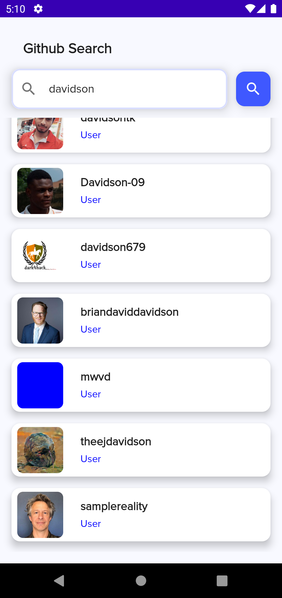
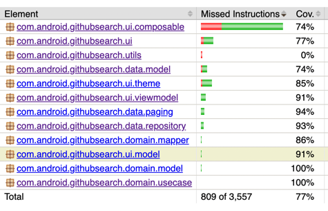

# Github Search
## Features 🎨

- **100% Kotlin-only project**.
- Coroutine, Jetpack compose, Hilt, Flow, Paging 3, AndroidX,MVVM, JUnit tests, MockWebServer.
- Jacoco Plugin to check test coverage
- 100% Gradle Kotlin DSL setup.
- Dependency versions managed via `buildSrc`.
- CI Setup with GitHub Actions.
- Kotlin Static Analysis via `ktlint` and `detekt`.
- Issues project (bug report + feature request)


## Gradle Setup 🐘

This project is using [**Gradle Kotlin DSL**](https://docs.gradle.org/current/userguide/kotlin_dsl.html) as well as the [Plugin DSL](https://docs.gradle.org/current/userguide/plugins.html#sec:plugins_block) to setup the build.

Dependencies are centralized inside the [buildSrc](buildSrc/src/main/kotlin) folder. This provides convenient auto-completion when writing your gradle files.

## Static Analysis 🔍

This project is using [**ktlint**](https://github.com/pinterest/ktlint) to format your code. To reformat all the source code as well as the buildscript you can run
```bash
# Run lint and display issues
./gradlew ktlintCheck
```


To fix the issues, run:
```bash
# Run lint and try to fix issues automatically (not all issues are fixable this way)
./gradlew ktlintFormat
```

This project is also using [**detekt**](https://github.com/detekt/detekt) to analyze the source code, with the configuration that is stored in the [detekt.yml](config/detekt/detekt.yml) file (the file has been generated with the `detektGenerateConfig` task).
```bash
# Run Detekt static code analysis validation
./gradlew detekt
```

If we ever need to re-generate our baseline for detekt run:
```bash
# Re-generate the baseline for Detekt
./gradlew detektBaseline
```

## Test Coverage 🔍

This project is using [**Jacoco**](https://github.com/arturdm/jacoco-android-gradle-plugin) to check test coverage. To generate the test coverage report you can run
```bash
# Generate test coverage report
./gradlew jacocoTestDebugUnitTestReport
```


## CI ⚙️

There are currently the following workflows available:
- [Android Pull Request & Master CI](.github/workflows/workflow.yml) - Will run the `build`, `check` and `assembleDebug` tasks.

## How To Build
Pull the code on this branch, import into Android Studio, from there you can run it like a standard
android project project or run ./gradlew assembleDebug. Further notes can be found here https://developer.android.com/studio/build/building-cmdline#DebugMode

## Screenshots


## Test Coverage


## Download Link
[Download](https://github.com/codose/GithubSearch/suites/5658978927/artifacts/185352080)
